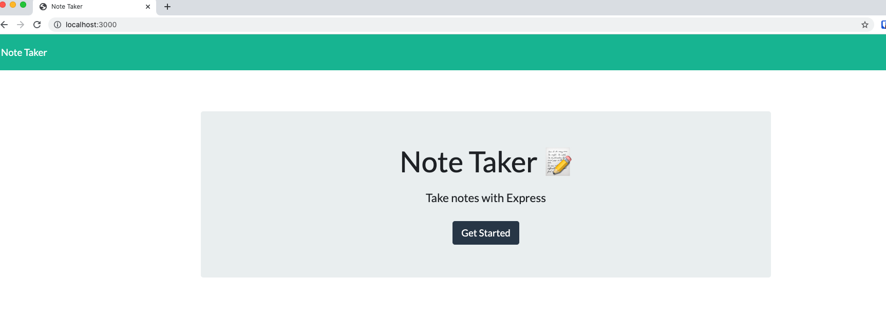
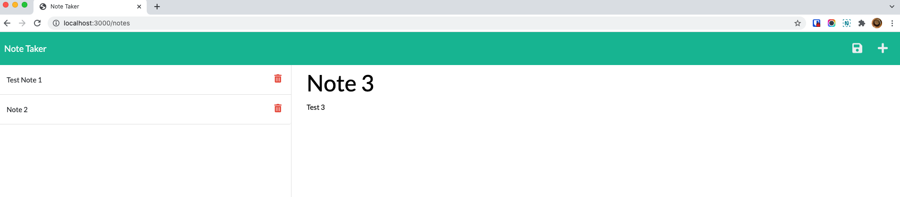

# Note Taker

# Table of Contents
- [Description](#description)
- [Installation](#installation)
- [Usage](#usage)
- [Screenshot](#screenshot)

## Description:
    Note Taker that can be used to write and save notes. 
    This application will use an Express.js back end and will save and retrieve note data from a JSON file.

## Installation:
    To install npm dependencies open terminal, locate the project folder and run the following in the command line:
    npm install

## Usage
    After the dependencies are installed, you can then run the back end with the following command in terminal:
    node server.js
    The application can be accessed in your browser when you enter this into your address bar:
    localhost:3000

## Screenshot
    The following image shows the web Weather dashboard appearance and functionality:

## Live Link
https://note-taker-nov21.herokuapp.com/notes